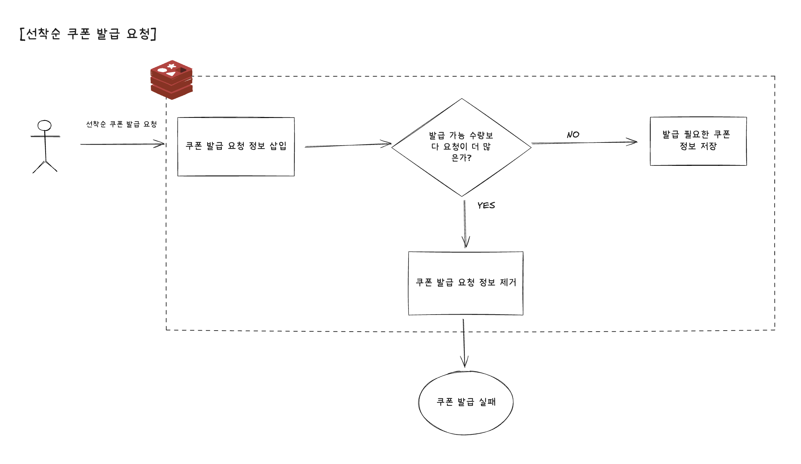
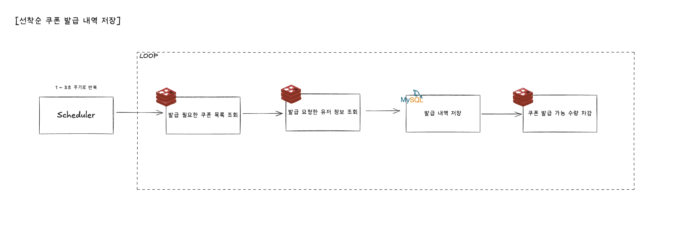

# 선착순 쿠폰 발급 - 레디스 활용 개선

## 도입 배경

- 선착순 쿠폰 발급의 경우, 이벤트성으로 발생하며 요청이 한 순간에 몰림
- 발급 요청 트래픽을 RDB에 바로 직행시키면 DB 부하가 크게 발생 가능
- 동시성 이슈 해결을 위해 DB락/분산락을 걸었지만, 선착순 보장은 어려웠음

## 고려 사항

### 1) 선착순 보장 필요 : 레디스의 Sorted Set(ZSET) 자료구조 활용

- `coupon-issue:{couponId}` key 값으로 특정 쿠폰에 대한 발급 요청 관리 가능
- `userId` 를 저장하여 특정 쿠폰 발급 요청한 유저 정보 저장
- `System.currentTimeMillis()` 활용하여 요청 시간을 score로 저장하여 선착순 보장 가능
- `addIfAbsent` 기능을 활용하여 이미 저장된 값이 새로운 요청에 덮어씌워지지 않도록 처리

### 2) 쿠폰 발급 가능 수량만큼 발급 : 레디스의 Sorted Set(ZSET),  자료구조 활용

- Lua 스크립트나 분산락 사용하여 동시성 이슈 제어하는 방법도 고려
  - Lua 스크립트는 라이브러리 의존적이고 추후 유지보수에 어려움이 있을 수 있음
  - 트래픽이 몰리는 상황에서 분산락을 걸었을 때 경합 상황 발생이 높아져 부하 발생
- Sorted Set(ZSET) 에 쿠폰 발급 요청 저장하고 해당 값은 size 비교를 통해 발급 가능 수량 여부 확인
- `coupon-stock:{couponId}` 값에 쿠폰 발급 가능 수량 확인 후 수량 비교 진행
  - 쿠폰 발행 시작 시점에 정보 초기 저장 필요

### 3) 중복 발급 방지 : 레디스의 Sorted Set(ZSET) 자료구조 활용

- DB 에서 unique key 설정으로 중복 발급을 이미 방지하고 있음
- 같은 요청이 오는 족족 DB 에 넣으려 시도하는 것 또한 부하를 줄 수 있음
- 레디스의 Sorted Set(ZSET) 자료구조에 요청한 userId 를 넣어 중복 요청을 한 번 제거하고 DB 저장 요청 가능

### 4) 발급 요청한 쿠폰 목록 필요 : 레디스의 SET 자료구조 활용

- `coupon-issue-pending` key 값으로 발급 요청한 쿠폰 목록 관리 가능
- SET 자료구조를 활용하면 중복 없이 발급 요청된 쿠폰 목록 관리 가능
- 쿠폰 발급 요청 시에 발급 요청이 들어온 쿠폰식별자를 미리 저장해두면 id로 관련 쿠폰 정보 찾아오기 쉬움
  - DB에서 발급가능수량이 0이 아니면서 만료되지 않은 쿠폰 목록 조회로도 처리 가능
  - DB 조회 시에는 쿠폰 전체 목록을 뒤져야 하고 성능 향상을 위해 조건절 처리를 위한 인덱스를 추후 추가해야할 가능성 있음

### 5) 발급 내역 정보 영구 저장 필요 : 스케줄러 활용

- 요청이 온 시점에 바로 DB에 저장하는 건 트래픽이 몰렸을 때 부하가 크므로 1 ~ 3초 간격으로 스케줄러가 모아서 요청 처리
- 발급 요청 저장 후, 특정 개수만큼 스케줄러로 발급 요청 정보를 꺼내서 DB에 넣어주는 방식으로 진행
- `coupon-stock:{couponId}` 값에 발행된 개수만큼 차감 필요

## Redis 자료 구조

Key | 타입 | 설명                     | 기타
-|-|------------------------|-
coupon-stock:{couponId} | String | 특정 쿠폰의 쿠폰 발급 가능 수량 (재고) | 쿠폰 발급 시작 시점에 미리 기록 필요
coupon-issue:{couponId} | Sorted Set | 특정 쿠폰의 선착순 발급 요청 유저 목록 | 유저식별자(userId)를 요청시점(timestamp) 기준으로 정렬하여 선착순 발급 가능
coupon-issue-pending | Set | 발급 요청 대기 중인 쿠폰식별자 목록 | 스케줄러로 어떠한 쿠폰들에 쿠폰 발급 요청이 왔는지 확인 후 발급 내역 DB 저장 위해 필요한 정보

## 비즈니스 로직 설계

### 1) 선착순 쿠폰 발급 요청 Redis 저장

1. `GET coupon-stock:{couponId}` → 쿠폰 발급 가능 수량(재고) 확보
2. `ZADD NX coupon-issue:{couponId} <timestamp> <userId>` → 쿠폰 발급 요청 삽입  
3. `ZRANK coupon-issue:{couponId} <userId>` → 순위 확인  
   * rank < stock → SUCCESS  
   * rank ≥ stock → `ZREM coupon-issue:{couponId} <userId>` → SOLD_OUT  
4. 성공 시 `SADD coupon-issue-pending <couponId>`

> 선착순 보장 + 재고 초과 X + 중복 방지

### 2) 스케줄러로 쿠폰 발급 내역 DB 저장

1. `SPOP coupon-issue-pending COUNT n` → 쿠폰 ID 목록 추출  
2. `ZPOPMIN coupon-issue:{couponId} n` → 발급 요청 토큰 (쿠폰별 발급 요청 유저 정보) 추출
3. JDBC batch INSERT (couponId, userId)
4. `DECRBY coupon-stock:{couponId} n` → 쿠폰 발급 수량 차감
5. ZSET에 토큰 or 재고가 남아 있으면 `SADD coupon-issue-pending <couponId>` 재등록

> 주기는 1~3초, 배치 크기는 500으로 시작해 트래픽·DB 부하에 따라 프로퍼티로 조정
