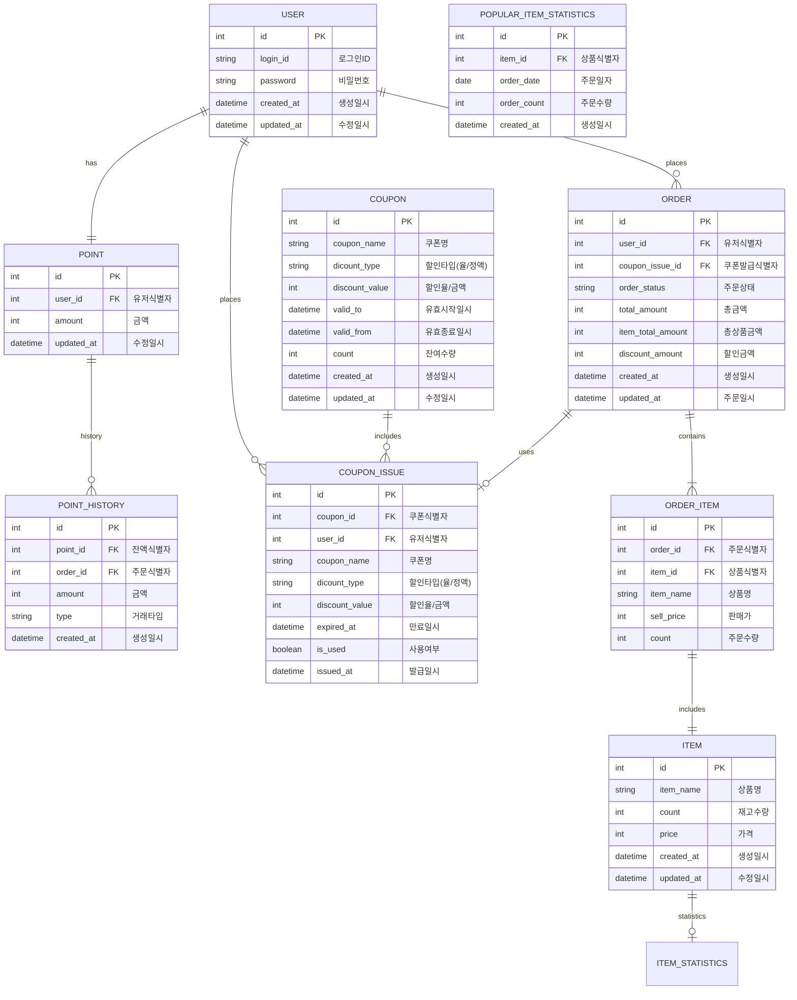

# ERD 설계도

```mermaid
erDiagram
    USER ||--|| POINT : has
    POINT ||--o{ POINT_HISTORY : history
    USER ||--o{ COUPON_ISSUE : places
    USER ||--o{ ORDER : places
    COUPON ||--o{ COUPON_ISSUE : includes
    ORDER ||--o| COUPON_ISSUE : uses
    ORDER ||--|{ ORDER_ITEM : contains
    ORDER_ITEM ||--|| ITEM : includes
    ITEM ||--o| ITEM_STATISTICS : statistics

USER {
    int id PK
    string login_id "로그인ID"
    string password "비밀번호"
    datetime created_at "생성일시"
    datetime updated_at "수정일시"
}

POINT {
    int id PK
    int user_id FK "유저식별자"
    int amount "금액"
    datetime updated_at "수정일시"
}

POINT_HISTORY {
    int id PK
    int point_id FK "잔액식별자"
    int order_id FK "주문식별자"
    int amount "금액"
    string type "거래타입"
    datetime created_at "생성일시"
}

COUPON {
    int id PK 
    string coupon_name "쿠폰명"
    string dicount_type "할인타입(율/정액)"
    int discount_value "할인율/금액"
    datetime valid_to "유효시작일시"
    datetime valid_from "유효종료일시"
    int count "잔여수량"
    datetime created_at "생성일시"
    datetime updated_at "수정일시"
}

COUPON_ISSUE {
    int id PK
    int coupon_id FK "쿠폰식별자"
    int user_id FK "유저식별자"
    string coupon_name "쿠폰명"
    string dicount_type "할인타입(율/정액)"
    int discount_value "할인율/금액"
    datetime expired_at "만료일시"
    boolean is_used "사용여부"
    datetime issued_at "발급일시"
}

ORDER {
    int id PK
    int user_id FK "유저식별자"
    int coupon_issue_id FK "쿠폰발급식별자"
    string order_status "주문상태"
    int total_amount "총금액"
    int item_total_amount "총상품금액"
    int discount_amount "할인금액"
    datetime created_at "생성일시"
    datetime updated_at "주문일시"
}

ORDER_ITEM {
    int id PK
    int order_id FK "주문식별자"
    int item_id FK "상품식별자"
    string item_name "상품명"
    int sell_price "판매가"
    int count "주문수량"
}

ITEM {
    int id PK
    string item_name "상품명"
    int count "재고수량"
    int price "가격"
    datetime created_at "생성일시"
    datetime updated_at "수정일시"
}

POPULAR_ITEM_STATISTICS {
    int id PK
    int item_id FK "상품식별자"
    date order_date "주문일자"
    int order_count "주문수량"
    datetime created_at "생성일시"
}
```