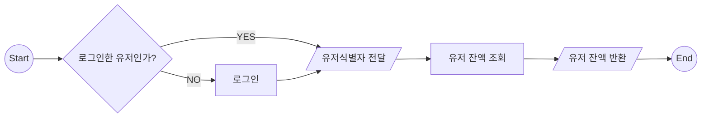
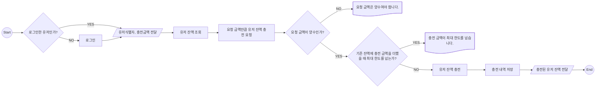
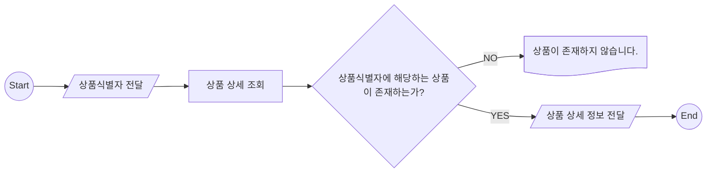
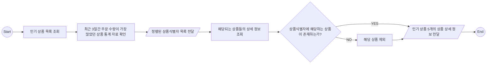
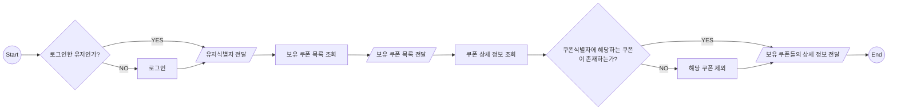
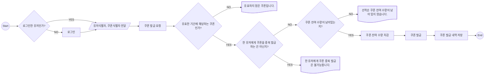

# 플로우 차트

## 잔액 조회

```mermaid
flowchart LR
    A@{ shape: circle, label: "Start" } --> B{로그인한 유저인가?}
    B -->|NO| C[로그인]
    B -->|YES| D@{ shape: lean-r, label: "유저식별자 전달" }
    C --> D
    D --> E[유저 잔액 조회]
    E --> F@{ shape: lean-r, label: "유저 잔액 반환" }
    F --> G@{ shape: circle, label: "End" }
```

## 잔액 충전

```mermaid
flowchart LR
    A@{ shape: circle, label: "Start" } --> B{로그인한 유저인가?}
    B -->|NO| C[로그인]
    B -->|YES| D@{ shape: lean-r, label: "유저식별자, 충전금액 전달" }
    C --> D
    D --> E[유저 잔액 조회]
    E --> F[요청 금액만큼 유저 잔액 충전 요청]
    F --> G{요청 금액이 양수인가?}
    G -->|NO| H@{ shape: doc, label: "요청 금액은 양수여야 합니다." }
    G -->|YES| I{기존 잔액에 충전 금액을 더했을 때 최대 한도를 넘는가?}
    I -->|YES| J@{ shape: doc, label: "충전 금액이 최대 한도를 넘습니다." }
    I -->|NO| K[유저 잔액 충전]
    K --> L[충전 내역 저장]
    L --> M@{ shape: lean-r, label: "충전된 유저 잔액 전달" }
    M --> N@{ shape: circle, label: "End" }
```

## 상품 조회

```mermaid
flowchart LR
    A@{ shape: circle, label: "Start" } --> B@{ shape: lean-r, label: "상품식별자 전달" }
    B --> C[상품 상세 조회]
    C --> D{상품식별자에 해당하는 상품이 존재하는가?}
    D -->|NO| E@{ shape: doc, label: "상품이 존재하지 않습니다." }
    D -->|YES| F@{ shape: lean-r, label: "상품 상세 정보 전달" }
    F --> G@{ shape: circle, label: "End" }
```

## 인기 상품 조회

```mermaid
flowchart LR
    A@{ shape: circle, label: "Start" } --> B[인기 상품 목록 조회]
    B --> C[최근 3일간 주문 수량이 가장 많았던 상품 통계 자료 확인]
    C --> D@{ shape: lean-r, label: "정렬된 상품식별자 목록 전달" }
    D --> E[해당되는 상품들의 상세 정보 조회]
    E --> F{상품식별자에 해당하는 상품이 존재하는가?}
    F -->|NO| G[해당 상품 제외]
    F -->|YES| H@{ shape: lean-r, label: "인기 상품 5개의 상품 상세 정보 전달" }
    G --> H
    H --> I@{ shape: circle, label: "End" }
```

## 보유 쿠폰 목록 조회

```mermaid
flowchart LR
    A@{ shape: circle, label: "Start" } --> B{로그인한 유저인가?}
    B -->|NO| C[로그인]
    B -->|YES| D@{ shape: lean-r, label: "유저식별자 전달" }
    C --> D
    D --> E[보유 쿠폰 목록 조회]
    E --> F@{ shape: lean-r, label: "보유 쿠폰 목록 전달" }
    F --> G[쿠폰 상세 정보 조회]
    G --> H{쿠폰식별자에 해당하는 쿠폰이 존재하는가?}
    H -->|YES| I@{ shape: lean-r, label: "보유 쿠폰들의 상세 정보 전달" }
    H -->|NO| J[해당 쿠폰 제외]
    J --> I
    I --> K@{ shape: circle, label: "End" }
```

## 선착순 쿠폰 발급

```mermaid
flowchart LR
    A@{ shape: circle, label: "Start" } --> B{로그인한 유저인가?}
    B -->|NO| C[로그인]
    B -->|YES| D@{ shape: lean-r, label: "유저식별자, 쿠폰식별자 전달" }
    C --> D
    D --> E[쿠폰 발급 요청]
    E --> F{유효한 기간에 해당하는 쿠폰인가?}
    F -->|NO| G@{ shape: doc, label: "유효하지 않은 쿠폰입니다." }
    F -->|YES| H{한 유저에게 쿠폰을 중복 발급하는 건 아닌지?}
    H -->|NO| I{쿠폰 잔여 수량이 남아있는지?}
    H -->|YES| J@{ shape: doc, label: "한 유저에게 쿠폰 중복 발급은 불가능합니다." }
    I -->|NO| K@{ shape: doc, label: "선착순 쿠폰 잔여 수량이 남아 있지 않습니다." }
    I -->|YES| L[쿠폰 잔여 수량 차감]
    L --> M[쿠폰 발급]
    M --> N[쿠폰 발급 내역 저장]
    N --> O@{ shape: circle, label: "End" }
```

## 주문 결제

```mermaid
flowchart LR
    A@{ shape: circle, label: "Start" } --> B{로그인한 유저인가?}
    B -->|NO| C[로그인]
    B -->|YES| D@{ shape: lean-r, label: "유저 정보, 주문할 상품 목록 전달" }
    C --> D
    D --> E[주문 요청]
    E --> F{상품 재고가 존재하는가?}
    F -->|NO| G@{ shape: doc, label: "주문하려는 상품의 재고가 품절되었습니다." }
    F -->|YES| H[상품 재고 차감]
    H --> I{유저에게 사용가능한 쿠폰이 존재하는가?}
    I -->|YES| J@{ shape: lean-r, label: "사용 가능한 쿠폰 중 할인 금액이 가장 큰 쿠폰 정보 전달" }
    J --> K[쿠폰 사용 처리]
    K --> L[쿠폰 사용 이력 저장]
    L --> M[총 금액에 쿠폰 할인 금액 적용]
    M --> N[결제 요청]
    N --> O{유저 잔액이 부족한가?}
    O -->|YES| P[재고 복원]
    O -->|NO| Q[주문 금액만큼 잔액 차감]
    Q --> R[잔액 차감 내역 저장]
    R --> S[주문 내역 저장]
    S --> T[주문 판매 관련 통계 데이터 전송]
    T --> U@{ shape: circle, label: "End" }
    P --> V{쿠폰을 사용하였는가?}
    V -->|YES| W[쿠폰 복원]
    V -->|NO| X@{ shape: doc, label: "잔액이 부족합니다." }
    W --> X
```
