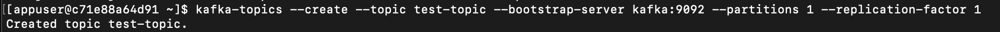
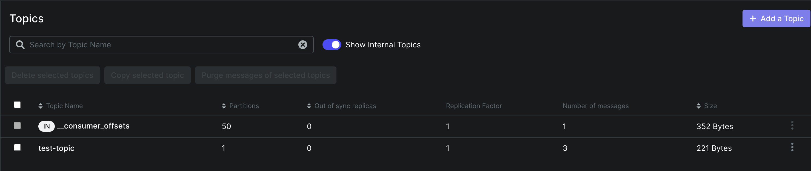
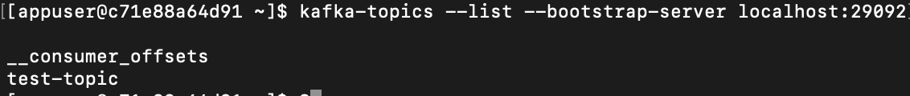
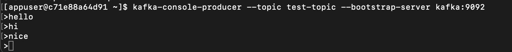
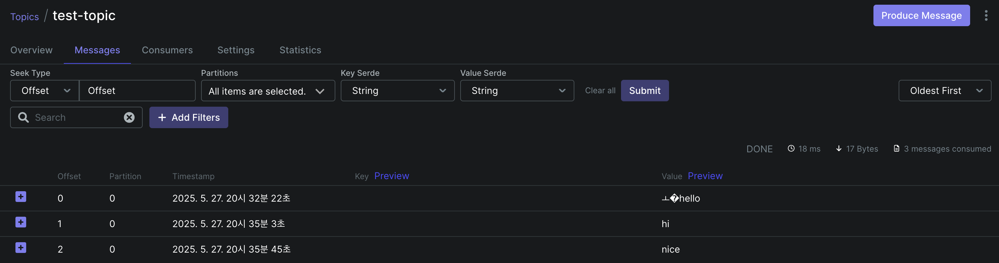
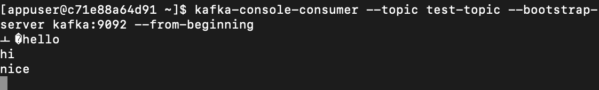
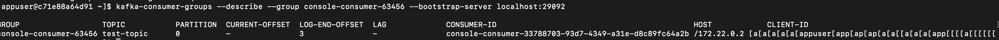
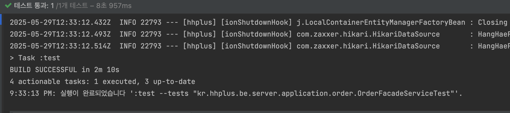

# Kafka 기초 학습 보고서

## 서론

기존 단일 애플리케이션 컨텍스트 내에서 ApplicationEventPublisher를 쓰던 이벤트 발행 방식을, MSA 환경으로 전환하면서 **Kafka** 기반의 분산 이벤트 스트리밍으로 대체한 과정을 정리합니다

- Kafka 개념 및 구조 학습 내용 정리
- Kafka 도커 설정 및 Spring 설정
- ApplicationEvent 발행을 Kafka 적용으로 변경
- Kafka 이벤트 발행 및 수신 테스트

## 1. Kafka 란?

Kafka는 “디스크 기반 분산 로그 시스템”이자 “실시간 스트리밍 플랫폼”입니다. 메시지 큐처럼 데이터를 전달하지만, append-only 로그 구조로 이벤트를 남기고, 소비자는 offset을 직접 관리하며 언제든
과거 이벤트를 재처리할 수 있다는 점이 가장 큰 차별점입니다.

### 특징

- 높은 처리량: 파티션 단위로 병렬 쓰기·읽기가 가능

- 내구성: 디스크에 영구 저장하고 복제(replication)

- 유연한 소비: pull 모델, offset 조작으로 재처리(replay) 지원

## 2. Kafka 기본 구조

### 1) Producer

- 애플리케이션에서 토픽에 메시지를 발행

- 키(key)를 주면 같은 키의 메시지가 같은 파티션에 저장

### 2) Broker

- 메시지를 저장·전달하는 서버 프로세스

- 여러 대를 묶어 클러스터로 운영, 리플리카(replica) 관리

### 3) Topic

- 논리적 메시지 스트림 이름

- 파티션(partition) 단위로 물리적 분할

### 4) Partition & Offset

- Partition: 순서 보장 단위, 병렬 처리 축

- Offset: 파티션 내 메시지 고유 번호 → 소비 위치 추적

### 4) Consumer Group

- 같은 그룹 ID를 가진 컨슈머끼리 파티션을 나눠 소비

- 각 파티션은 그룹당 하나의 컨슈머만 읽어, 메시지 중복 방지

## 3. 로컬 개발 환경 구성 (docker-compose)

### 1)  Kafka 설정

```yml
services:
  kafka:
    image: confluentinc/cp-kafka:latest
    ports:
      - "29092:29092"
    environment:
      KAFKA_NODE_ID: 1
      KAFKA_PROCESS_ROLES: 'broker,controller'
      KAFKA_CONTROLLER_QUORUM_VOTERS: '1@kafka:29093'
      KAFKA_LISTENERS: 'PLAINTEXT://kafka:9092,CONTROLLER://kafka:29093,PLAINTEXT_HOST://0.0.0.0:29092'
      KAFKA_ADVERTISED_LISTENERS: 'PLAINTEXT://kafka:9092,PLAINTEXT_HOST://localhost:29092'
      KAFKA_LISTENER_SECURITY_PROTOCOL_MAP: 'CONTROLLER:PLAINTEXT,PLAINTEXT:PLAINTEXT,PLAINTEXT_HOST:PLAINTEXT'
      KAFKA_CONTROLLER_LISTENER_NAMES: 'CONTROLLER'
      KAFKA_INTER_BROKER_LISTENER_NAME: 'PLAINTEXT'
      KAFKA_OFFSETS_TOPIC_REPLICATION_FACTOR: 1
      KAFKA_TRANSACTION_STATE_LOG_REPLICATION_FACTOR: 1
      CLUSTER_ID: 'hhplus-ecommerce'
      KAFKA_LOG_DIRS: '/tmp/kraft-combined-logs'
```

### 2) Kafka UI 설정

```yml
services:
  kafka-ui:
    image: provectuslabs/kafka-ui:latest
    ports:
      - "8080:8080"
    environment:
      KAFKA_CLUSTERS_0_NAME: local
      KAFKA_CLUSTERS_0_BOOTSTRAPSERVERS: kafka:9092
    depends_on:
      - kafka
```

## 4. Kafka 콘솔 명령어

### 1) Kafka 컨테이너 접속

```
docker exec -it hhplus-ecommerce-kafka-1 bash
```

### 2) 토픽 생성

```
kafka-topics --create --topic test-topic --bootstrap-server kafka:9092 --partitions 1 --replication-factor 1
```





### 3) 토픽 리스트 조회

```
kafka-topics --list --bootstrap-server localhost:29092
```



### 4) 메시지 발행

```
kafka-console-producer --topic test-topic --bootstrap-server kafka:9092
```





### 5) 메시지 소비

```
kafka-console-consumer --topic test-topic --bootstrap-server kafka:9092 --from-beginning
```



### 6) 그룹 상태 조회

```
kafka-consumer-groups --describe --group console-consumer-63456 --bootstrap-server localhost:29092
```



## 5. Spring Boot 연동 설정

### 1) build.gradle 설정

```
implementation("org.springframework.kafka:spring-kafka")
```

### 2) application.yml 설정

```yaml
kafka:
  bootstrap-servers: localhost:29092
  properties:
    request.timeout.ms: 20000
    retry.backoff.ms: 500
    auto:
      create.topics.enable: false
      register.schemas: false
      offset.reset: earliest
    use.latest.version: true
    basic.auth.credentials.source: USER_INFO
  producer:
    key-serializer: org.apache.kafka.common.serialization.StringSerializer
    value-serializer: org.springframework.kafka.support.serializer.JsonSerializer
    retries: 5
  consumer:
    group-id: hhplus-ecommerce
    key-deserializer: org.apache.kafka.common.serialization.StringDeserializer
    value-deserializer: org.springframework.kafka.support.serializer.JsonDeserializer
    properties:
      spring.json.trusted.packages: "kr.hhplus.be.server.domain.*"
```

## 6. 주문 완료 이벤트 발행 시 Kafka 적용

### 1) 기존 : ApplicationEvent 발행

- ApplicationEventPublisher 적용하여 주문 완료 이벤트 발행

  ```java
  public class OrderApplicationEventPublisher implements OrderEventPublisher {
  
      private final ApplicationEventPublisher applicationEventPublisher;
  
      public OrderApplicationEventPublisher(ApplicationEventPublisher applicationEventPublisher) {
          this.applicationEventPublisher = applicationEventPublisher;
      }
  
      @Override
      public void send(OrderCompleteEvent event) {
          applicationEventPublisher.publishEvent(event);
      }
  }
  ```

- TransactionalEventListener 적용하여 주문 완료 이벤트 수신

  ```java
  @Slf4j
  @Component
  public class OrderEventListener {
  
      private final DataPlatformClient dataPlatformClient;
  
      public OrderEventListener(DataPlatformClient dataPlatformClient) {
          this.dataPlatformClient = dataPlatformClient;
      }
  
      @Async
      @TransactionalEventListener(phase = TransactionPhase.AFTER_COMMIT)
      public void handleOrderCompleteEvent(OrderCompleteEvent event) {
          try {
              dataPlatformClient.sendOrderData(event.orderInfo());
              log.info("주문 정보 데이터 플랫폼 전송 성공");
          } catch (Exception e) {
              log.error("주문 정보 데이터 플랫폼 전송 실패");
          }
      }
  }
  ```

  ```java
  @Slf4j
  @Component
  public class PopularItemEventListener {
  
      private final PopularItemService popularItemService;
  
      public PopularItemEventListener(PopularItemService popularItemService) {
          this.popularItemService = popularItemService;
      }
  
      @Async
      @TransactionalEventListener(phase = TransactionPhase.AFTER_COMMIT)
      public void handleOrderCompleteEvent(OrderCompleteEvent event) {
  
          try {
              event.getOrderItems()
                      .forEach((orderItem) -> popularItemService.savePopularItemScore(orderItem.getItemId(), orderItem.getCount()));
              log.info("오늘 주문 판매량 집계 완료");
          } catch (Exception e) {
              log.error("오늘 주문 판매량 집계 실패");
          }
      }
  }
  ```

최초에는 주문 시 한 트랜잭션 안에서 외부 데이터플랫폼 클라이언트에 주문 데이터 전송하는 로직이 포함되어 있엇다. 이로 인해 부가로직 실패가 발생했을 때 주문 주요로직이 롤백되는 문제가 발생하였습니다.

이를 해결하기 위해 ApplicationEventPublisher 를 통해 도메인 이벤트를 발행하고 `@TransactionalEventListener` 로 이벤트를 수신하여, 트랜잭션 커밋 이후 비동기적으로
부가로직이 이루어질 수 있게 느슨한 결합을 만들고자 하였습니다.

ApplicationEvent 를 사용했던 이유는 단일 애플리케이션에서 즉시 이벤트 전달로 의존성을 줄일 수 있고 구현이 단순하여 도입을 빠르게 할 수 있었기 때문입니다.

### 2) 변경 : Kafka 적용하여 이벤트 발행

- KafkaProducer 적용하여 카프카에 주문 완료 이벤트 발행

  ```java
  @Configuration
  public class KafkaTopicConfig {
  
      @Bean
      public NewTopic orderCompleteTopic() {
          return TopicBuilder
                  .name("order-complete")
                  .partitions(3)
                  .replicas(3)
                  .build();
      }
  }
  ```

  ```java
  @Slf4j
  @Component
  public class OrderKafkaEventPublisher implements OrderEventPublisher {
  
      private static final String ORDER_COMPLETE_TOPIC = "order-complete";
      private final KafkaTemplate<String, OrderCompleteEvent> kafkaTemplate;
  
      public OrderKafkaEventPublisher(KafkaTemplate<String, OrderCompleteEvent> kafkaTemplate) {
          this.kafkaTemplate = kafkaTemplate;
      }
  
      @Override
      public void send(OrderCompleteEvent event) {
          log.info("Produce message : " + event);
          this.kafkaTemplate.send(ORDER_COMPLETE_TOPIC, event);
      }
  }
  ```

- KafkaConsumer 적용하여 카프카에서 주문 완료 이벤트 소비

  ```java
  @Slf4j
  @Component
  public class OrderEventListener {
  
      private final DataPlatformClient dataPlatformClient;
  
      public OrderEventListener(DataPlatformClient dataPlatformClient) {
          this.dataPlatformClient = dataPlatformClient;
      }
  
      @KafkaListener(topics = "order-complete", groupId = "order", concurrency = "3")
      public void handleOrderCompleteEvent(OrderCompleteEvent event) {
          try {
              dataPlatformClient.sendOrderData(event.orderInfo());
              log.info("주문 정보 데이터 플랫폼 전송 성공");
          } catch (Exception e) {
              log.error("주문 정보 데이터 플랫폼 전송 실패");
          }
      }
  }
  ```

  ```java
  @Slf4j
  @Component
  public class PopularItemEventListener {
  
      private final PopularItemService popularItemService;
  
      public PopularItemEventListener(PopularItemService popularItemService) {
          this.popularItemService = popularItemService;
      }
  
      @KafkaListener(topics = "order-complete", groupId = "popular-item", concurrency = "3")
      public void handleOrderCompleteEvent(OrderCompleteEvent event) {
  
          try {
              event.getOrderItems()
                      .forEach((orderItem) -> popularItemService.savePopularItemScore(orderItem.getItemId(), orderItem.getCount()));
              log.info("오늘 주문 판매량 집계 완료");
          } catch (Exception e) {
              log.error("오늘 주문 판매량 집계 실패");
          }
      }
  }
  ```

MSA 환경으로 전환이 필요한 시점으로, 여러 서비스/인스턴스가 독립적으로 배포/운영되는 환경이라는 가정 하에서 ApplicationEvent 방식에서 Kafka 기반으로 교체하고자 하였습니다.

ApplicationEvent 는 애플리케이션 단일 인스턴스 내부에서 동작하여 같은 애플리케이션 컨텍스트에 있어야만 통신이 가능하였습니다. 또한, 애플리케이션 장애 시 메모리 이벤트는 유실될 수 있고, 이미 처리된
이벤트를 재처리하기는 어려운 문제점들이 있었습니다.

Kafka 기반 이벤트 발행으로 변경하면 토픽만 알면 어떤 서비스든 이벤트 구독이 가능하고 여러 서비스/인스턴스 환경에서 느슨한 결합이 이루어질 수 있습니다. 또한, 디스크에 로그가 남아 장애 후에도 이벤트 보존이
가능하고 오프셋 조작으로 과거 메세지 재처리도 가능한 장점이 있습니다.

KafkaEventListener 는 MSA로 분리되었다고 생각했을 때 외부에서 받는 값이므로 클린 아키텍쳐 상 패키지 위치를 `interfaces` 로 변경하였습니다.


## 7. 카프카 이벤트 발행 및 수신 테스트

### 1) 테스트 컨테이너 설정

```java

@Configuration
class TestcontainersConfiguration {

    //...

    private static final String KAFKA_IMAGE = "confluentinc/cp-kafka:7.0.1";
    private static final KafkaContainer KAFKA_CONTAINER;

    static {
        //...

        KAFKA_CONTAINER = new KafkaContainer(DockerImageName.parse(KAFKA_IMAGE))
                .withKraft()
                .withEnv("KAFKA_AUTO_CREATE_TOPICS_ENABLE", "true");

        KAFKA_CONTAINER.start();

        System.setProperty("spring.kafka.bootstrap-servers", KAFKA_CONTAINER.getBootstrapServers());
    }

    @PreDestroy
    public void preDestroy() {
        //...

        if (KAFKA_CONTAINER.isRunning()) {
            KAFKA_CONTAINER.stop();
        }
    }
}
```

### 2) 카프카 이벤트 발행 및 수신 테스트

```java
@SpringBootTest
@Testcontainers
public class OrderFacadeServiceTest {
    @Test
    void 주문_완료_시_데이터플랫폼_데이터_전송_및_인기상품_통계_데이터_저장() {

        //given
        User user = userJpaRepository.save(UserFixtures.정상_유저_생성());
        Item item = itemJpaRepository.save(ItemFixtures.재고로_상품_생성(Stock.of(10)));
        Point point = pointJpaRepository.save(PointFixtures.유저와_금액으로_잔액_생성(user, 100000));

        OrderCreateFacadeCommand command = OrderCreateFacadeCommand.of(null, List.of(
                new OrderItemCreateFacadeCommand(item.getId(), 10)
        ));

        //when
        orderFacadeService.placeOrder(user, command);

        //then
        Awaitility.await()
                .atMost(Duration.ofSeconds(10))
                .untilAsserted(() -> {
                    verify(orderEventListener, times(1)).handleOrderCompleteEvent(any());
                    verify(popularItemEventListener, times(1)).handleOrderCompleteEvent(any());
                });
    }
}
```



ApplicationEvent 를 Kafka 이벤트 발행으로 변경했을 때 제대로 이벤트 발행 및 수신이 되는지 확인하기 위해 통합 테스트를 진행하였습니다.

기존 이벤트 발행 수신 여부 확인을 위한 테스트를 그대로 두고 동일하게 이벤트 발행 후 수 초 안에 EventListener 에서 수신하여 부가 로직인 1) 외부 데이터 플랫폼 데이터 전송, 2) 인기상품 통계
데이터 저장 작업이 수행되고 있는지를 확인해보았습니다.