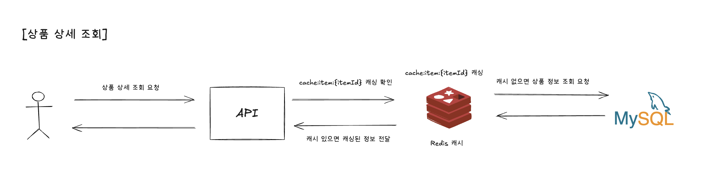
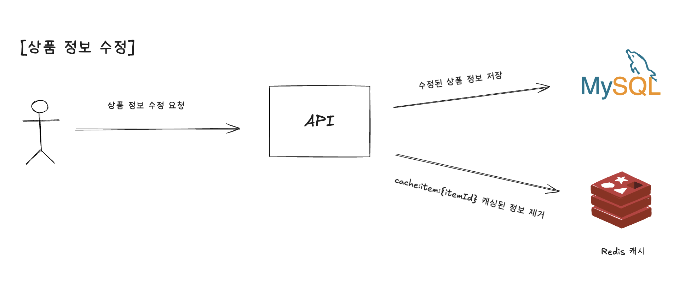
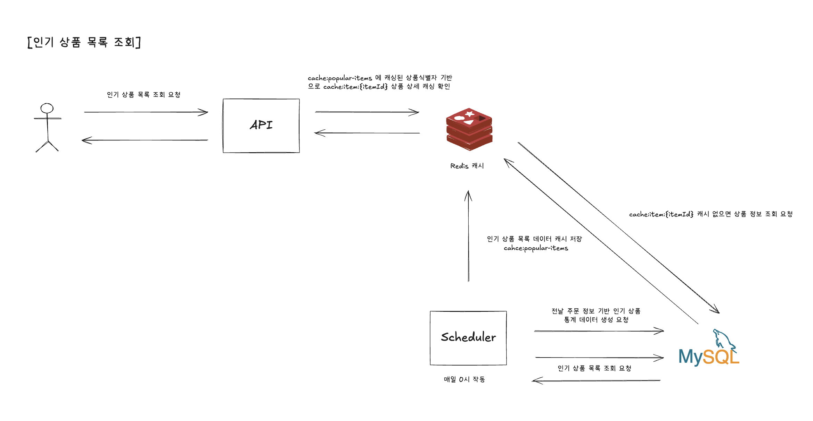
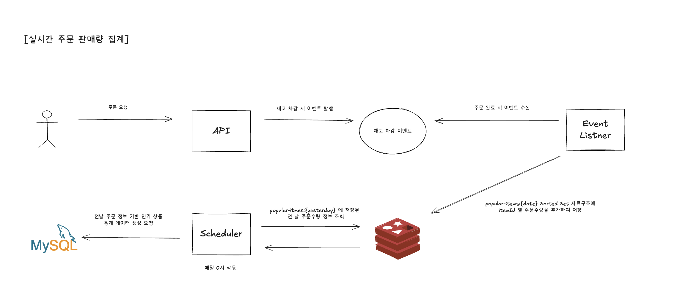

# 인기 상품 목록 조회 - 레디스 캐시 활용 개선

## 도입 배경

- 인기 상품 목록 조회는 사람들이 자주 사용하는 기능으로 매번 쿼리로 집계하면 DB가 많이 갈 수 있음
- 상품 정보는 쓰기 요청보다는 조회 요청이 현저히 많이 발생함

## Redis 캐시 구조

Key | 캐시 전략                      | 설명                           | 기타
-|----------------------------|------------------------------|-
cache:item:{itemId} | Cache-Aside + Write-Around | 상품 상세 정보 캐시                  | 1) 상품 상세 조회 시 `@Cacheable` 활용하여 캐싱, 2) 상품 정보 변경 시 `@CacheEvict` 활용하여 기존 캐시 제거
cache:popular-items | Read-through               | 인기 상품 목록 정보 캐시 (상품식별자 정보 소유) | 스케줄러로 매일 주문 정보 바탕으로 인기 상품 통계 테이블 데이터 저장 후 `@CachePut` 으로 인기 상품 목록 새로 캐싱

## 비즈니스 로직 설계

### 1) 상품 상세 조회 : 캐시 활용

- 상품 상세 조회는 자주 변하는 정보가 아니고 실시간성이 중요한 정보가 아니므로, `cache:item:{itemId}` 기준으로 캐싱
- 보통 상품 상세는 연관 데이터가 엄청 많기 때문에 한 번 캐싱해두면 DB 부하가 많이 줄 수 있음
- 가격 등 주요 정보는 변경 시 바로 반영될 필요가 있어서 `Cache Evict`를 통해서 캐시 업데이트 필요

### 2) 인기 상품 목록 조회 : 통계테이블, 캐시 활용

- 인기 상품 정의 : 3일 전 ~ 1일 전 주문 판매량이 가장 많은 순 상위 5개의 상품
- 인기 상품 목록 조회를 위해서 쿼리를 통해 매번 집계할 경우 DB 부하가 많이 발생 가능
- 스케줄러로 매일 0시에 전날 전체 주문 데이터를 바탕으로 통계 테이블에 데이터 저장 - (상품 ID, 주문날짜, 판매량 등)
- 통계 테이블 저장하면서 인기 상품 목록 조회 데이터 캐싱
  - 상품 상세 정보는 정보 변경으로 바뀔 수 있지만 리스트 형태로 캐싱하면 반영 위해 전체를 다시 덮어씌워야 하는 문제 발생
  - 인기 상품 목록 조회로 상품 ID 목록을 가지도록 하고, 상품 ID에 해당하는 상품 상세 조회 따로 해오도록 함 (상품 상세 조회도 캐싱되어 있으므로)

# 인기 상품 목록 조회 - 레디스 자료구조 활용 개선

## 도입 배경

- 통계 테이블을 활용할 때 실시간 반영이 어려운 문제가 있음 
- 전날 주문을 바탕으로 통계 테이블 데이터 저장 시에 상품별 그룹핑 등의 집계 쿼리로 DB 부하 발생 가능

## Redis 자료 구조

Key | 타입         | 설명                  | 기타
-|------------|---------------------|-
popular-items:{date} | Sorted Set | 특정 날짜의 상품별 주문판매량 정보 | 주문 완료 시 주문 상품별 주문 판매량 실시간 저장

## 비즈니스 로직 설계

### 1) 주문 완료 시 해당 날짜 상품별 주문판매량 바로 집계 : 이벤트, 레디스의 Sorted Set(ZSET) 자료구조 활용

- 재고 차감 시 상품식별자와 주문수량 정보를 담은 이벤트 발행
- 주문 트랜잭션 완료 후 이벤트 수신하여 해당 날짜 상품별 주문판매량을 바로 적재
- 스케줄러로 매일 0시에 주문 테이블 집계 후 저장할 필요 없이 레디스에 적재된 정보 바탕으로 통계 테이블 데이터 저장
- 인기 상품 목록 조회 시에 실시간 주문수량 반영 가능
