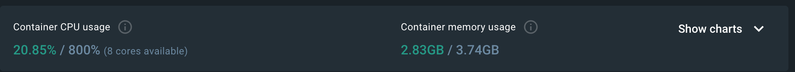

# 부하 테스트 결과 분석 보고서

## SLO 기준

- p95 < 500ms : 95% 이상의 요청이 500ms 이하 유지
- 에러율 < 5% : 실패율 5% 미만 유지

## 부하 테스트 결과 분석

2 CPU / 메모리 4GB 기준으로 하여 부하테스트를 진행하고, 결과에 따라 어느 정도의 인프라 스펙이 필요한지에 대해 판단하고자 합니다.

[부하테스트 계획 보고서](scenario_load_test_plan.md) 에 작성한 시나리오 기반으로 K6 스크립트를 작성하여 부하테스트를 진행하였습니다.

로컬 환경에서 진행하다보니 컴퓨터 성능 자체는 8 CPU / 8 GB 최대로 제한되어 있으며 이미 사용하고 있는 메모리가 존재하여, 메모리는 4GB 정도로 제한되어 있는 상황에서 한정적으로 테스트한 결과입니다.

정확한 부하테스트결과 확인을 위해서는 추후 운영 환경과 동일한 환경을 구축하여 클라우드 환경에서 다시 진행할 필요가 있어보입니다.

### 상품 상세 조회 시나리오

상품 상세 조회는 고객들이 가장 많이 접근하는 엔드포인트로 기준으로 삼은 평시 RPS를 견딜 수 있는 수준의 인프라를 구축하고, 트래픽이 많이 몰리는 피크 RPS 기준으로 오토스케일링이 될 수 있어야 합니다.

#### VU ≤ 2700, 2 CPU / 4 GB 제한

| 구분 | 결과 | 목표 | 상태 / 의미 |
| --- | --- | --- | --- |
| **실패율** | **66.6 %** (124 k / 187 k) | < 5 % | **심각한 실패** |
| **p95 지연** | **9.56 s** | < 0.5 s | 19 × 초과 |
| p90 / 평균 | 7.6 s / 1.7 s | — | 전반적 응답 지연 |
| 최댓값 | 43.7 s | — | 타임아웃 수준 |
| **VU-효율** | 2 700 VU → 620 RPS (0.23 RPS/VU) | ≥ 1 RPS/VU | 대기·재시도 지옥 |
| **성공 체감** | 3 건 중 2 건 실패 | — | UX 붕괴 |

#### VU ≤ 2700, 4 CPU / 8 GB 제한 

| 항목 | 측정값 | 목표 | 상태·비교 |
| --- | --- | --- | --- |
| 실패율 | **0.02 %** (56/265 964) | < 5 % | ✅ (이전 66 % → **대폭 개선**) |
| p95 지연 | **7.48 s** | < 0.5 s | ❌ (이전 9.56 s → **↓ 22 %**지만 여전히 15× 초과) |
| p90 / 중앙값 | 4.96 s / 1.79 s | — | *대기 꼬리* 길이 완화됐지만 크게 남음 |
| 최대값 | 29.5 s | — | 타임아웃·락 지속 |
| 평균 RPS | **882 req/s** | 평시 목표 1 800 | ≈ 50 % 수준 |
| VU 효율 | 2 700 VU → 882 RPS (**0.33 RPS/VU**) | ≥ 1 RPS/VU | 여전히 자원 대기 큼 |

사용할 수 있는 Docker 컨테이너 상에서 app 실행 환경값 변경을 통해 얼마나 큰 변화가 있는지 확인해보고자 했습니다.

1800RPS 기준으로 2700 VU를 잡았을 때, CPU 성능 개선을 하더라도 p95 지연이 많이 발생하는 것을 알 수 있습니다. 운영 환경에서는 저 수준 이상으로 잡아야 하지 않을까 싶습니다.

100만 건의 상품 중 랜덤한 조회가 이루어지게 하여 캐시 성능을 전혀 이용하지 못하고 있는 것도 문제 인 것 같아서, 인기 상품 위주로 주로 조회가 많이 이루어진다는 가정 하에 추가 테스트를 진행해 보고자 하였습니다.

#### VU ≤ 2700, 4 CPU / 8 GB 제한, 상품 주요 1000건 중 중복 조회 발생
| 지표 | 전(100 만 균등 랜덤) | **이번(상위 1 000 랜덤)** | 변화폭 |
| --- |--------------| --- | --- |
| **p95 지연** | **7.48 s**   | **1.67 s** | ▼ 60 % |
| p90 | 4.96 s       | 1.41 s | ▼ 56 % |
| 평균 | 1.79 s       | 0.71 s | ▼ 59 % |
| 실패율 | 0.02 %       | 0 % | 유지 |
| RPS | 882          | **2 991** | ▲ 2.5× |
| VU 효율 | 0.33 RPS/VU  | **1.11 RPS/VU** | ▲ 3.4× |

원하는 p95 지연까지 내려오지 않았지만 캐시 히트가 많이 발생하게 되면 성능이 확 개선되는 것을 확인해볼 수 있습니다.

#### VU ≤ 1500, 4 CPU / 8 GB 제한

| 지표 | 값 | 목표 | 상태·해석 |
| --- | --- | --- | --- |
| **실패율** | **0 %** (0 / 1 549 027) | < 5 % | ✅ 완전 성공 |
| **p95 지연** | **483 ms** | < 500 ms | ✅ **SLO 통과** |
| p90 / 평균 | 396 ms / 223 ms | — | 여유 충분 |
| 최대값 | 22.4 s *(0.001 % 꼬리)* | 관찰권장 | 극소수 슬로우쿼리/락 |
| **처리량** | **5 163 RPS** | 블프 목표 4 300 RPS ↑ | ✅ 목표 초과 |
| **VU 효율** | 1 500 VU → 5 163 RPS (3.4 RPS/VU) | ≥ 1 RPS/VU | 높은 효율 |

지금 로컬 환경 상에서는 vUser 1500 정도일 때 목표 성공 기준을 준수할 수 있는 것으로 보입니다.

### 주문 시나리오

#### VU ≤ 325, 4 CPU / 8 GB

| 카테고리 | 지표 | 관찰값 | 목표 / 기대 | 해석 |
| --- | --- | --- | --- | --- |
| **신뢰성** | 실패율 | **0 %** (0 / 58 617) | < 5 % | ✅ 완전 정상 |
| **지연 시간** | p95 | **21 ms** | < 500 ms | ✅ SLO 여유 × 20 |
|  | p90 / 평균 | 13 ms / 8 ms | — | 캐시·DB 모두 빠름 |
| 최대값 | 2.8 s *(0.002 %)* | 관리권장 | 드문 슬로우쿼리 |  |
| **처리량** | 평균 RPS | **194 req/s** | 평시 목표 1 800 TPS | **낮음** |
| **VU 효율** | 325 VU → 194 RPS(**0.6 RPS/VU**) | ≥ 1 RPS/VU | think-time(4 s) 때문 |  |
| **Iteration** | p95 | 4.05 s | 설계 4 s | 정상 (sleep 2 × 2 s) |

주문 시나리오는 제일 주요한 로직이 피크 RPS 기준으로 구매전환율 5% 적용하였을 때, 충분히 안정적으로 구동하는지 확인하고자 부하테스트를 진행하였습니다.

결과적으로 구매전환율 5% 라고 고려했을 때 1) 상품 상세 조회 2) 보유 쿠폰 조회 3) 주문 까지의 플로우가 성능적으로 문제 없이 잘 이루어지는 것을 살펴볼 수 있었습니다. 

### 선착순 쿠폰 발급 시나리오

## 장애 대응 방법

### 메트릭 & 알람 기준 설정

| 지표 | 경고 | 위험 |
| --- | --- | --- |
| p95 지연시간 | > 800ms | > 1200ms |
| 에러율 | > 1% | > 5% |
| CPU 사용률 | > 80% 3m 지속 | > 95% 1m 지속 |
| DB 커넥션 사용률 | > 70% | > 90% |

- 장애가 발생되기 전에 미리 대응할 수 있도록 알람 설정
- Grafana Alert Rule에 임계값 적용하여, 임계값을 넘는 경우 Slack/Teams 알림 받도록 설정

