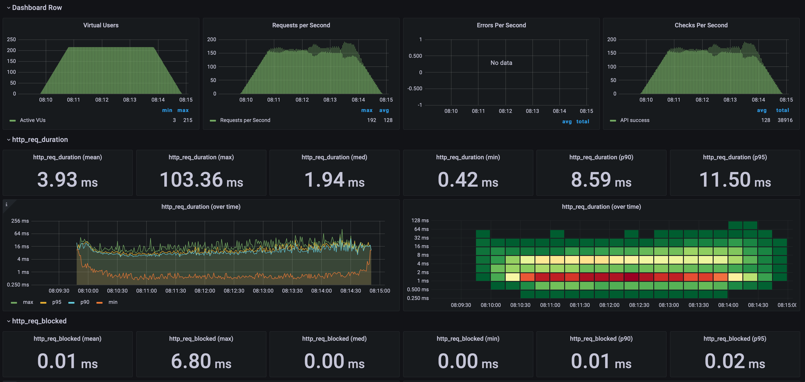

# 부하 테스트 결과 분석 보고서

## 상품 상세 조회 시나리오

### VU ≤ 4300, 2 CPU / 4 GB

| 영역 | 지표 | 결과 | SLO / 목표 | 판정 |
| --- | --- | --- | --- | --- |
| **성공률** | 실패율 `http_req_failed` | **0.04 %** (232 / 553 883) | < 5 % | ✅ |
| **지연 시간** | p95 `http_req_duration` | **12.4 s** | < 0.5 s | **❌ 실패 (×25)** |
|  | p90 / 평균 / 최대 | 9.5 s / 4.0 s / **60 s** | — | 꼬리 매우 길다 |
| **처리량** | 평균 RPS | **612 req/s** | 목표 TPS 기준 확인 | — |
| **시나리오 시간** | iteration p95 | 14.2 s | — | 대기/재시도 누적 → 길어짐 |
| **병목 신호** | VU 효율 | 4 300 VU → 612 RPS (0.14 RPS/VU) | 정상은 ≥ 1 RPS/VU | **심각한 대기** |

### VU ≤ 1800, 2 CPU / 4 GB

| 항목 | 결과 | 목표 | 상태·해석 |
| --- | --- | --- | --- |
| **실패율** | **0.07 %** (194/266 933) | < 5 % | ✅ 정상 |
| **p95 지연시간** | **3.62 s** | < 0.5 s | **❌ 7.2 × 초과** |
| p90 / 평균 | 2.57 s / 1.62 s | — | 전반적 지연 ↑ |
| 최대값 | 22.2 s | — | 긴 꼬리 → 락/슬로우쿼리 의심 |
| **효율** | 1 800 VU → 890 RPS(**0.49 RPS/VU**) | 기대 1 RPS/VU↑ | 대기·재시도 많음 |
| **총 처리량** | 2.67 × 10⁵ req, 52 MB in | — | 평시 DAU 1.65 M 과 비슷한 초당 요청 수준 |

### VU ≤ 100, 2 CPU / 4 GB

| 항목 | 측정값 | 목표 / 기준 | 판정·해석 |
| --- | --- | --- | --- |
| **신뢰성** | 실패율 `http_req_failed` = **0 %** (0 / 434 754) | < 5 % | ✅ 완전 성공 |
| **지연 시간** | p95 = **170 ms** | < 500 ms | ✅ 넉넉한 버퍼 (≈ 3× 빠름) |
|  | p90 / 평균 / 중앙값 | 111 ms / 51 ms / 24 ms | — |
|  | 최댓값 | **8.86 s** (0.002 % 꼬리) | 관찰 필요 |
| **처리량** | 평균 RPS | **1 449 req/s** | 평시 목표 1 800 TPS 대비 80 % |
|  | 총 요청 수 | 434 K | — |
| **VU 효율** | 100 VU → 1 449 RPS (**14.5 RPS/VU**) | 1+ RPS/VU면 양호 | **효율 우수**—대기 없음 |
| **Iteration** | p95 = 183 ms (평균 55 ms) | — | think-time 없는 단일 호출 구조 |

## 주문 시나리오

### VU ≤ 90, 2 CPU / 4 GB

| 카테고리 | 지표 | 결과 | SLO/임계값 | 판정 |
| --- | --- | --- | --- | --- |
| **성공률** | 실패율 `http_req_failed` | **0 %** (0 / 16 161) | < 5 % | ✅ |
| **지연 시간** | p95 `http_req_duration` | **37 ms** | < 500 ms | ✅ |
|  | 평균 / p90 / 최대 | 12 ms / 29 ms / 253 ms | — |  |
| **처리량** | 총 요청 | 16 161 | — |  |
|  | 평균 RPS | **53 req/s** | 참조치 | — |
| **Iteration** | 평균 길이 | 4.03 s | 스크립트 sleep (≈4 s) 정상 | — |
|  | p95 | 4.07 s | — |  |
| **자원 사용(테스트 측)** | Max VU | 90 | — |  |

### VU ≤ 210, 2 CPU / 4 GB

| 영역 | 지표 | 측정값 | 목표 / 참고치 | 상태 |
| --- | --- | --- | --- | --- |
| **신뢰성** | 실패율 `http_req_failed` | **0 %** (0 / 38 928) | < 5 % | ✅ |
| **지연 시간** | p95 `http_req_duration` | **11.5 ms** | < 500 ms | ✅ (버퍼 ×43) |
|  | p90 / 평균 / 최대 | 8.6 ms / 3.9 ms / **103 ms** | — | 꼬리 짧음 |
| **처리량** | 총 요청 | 38 928 | — | — |
|  | 평균 RPS | **129 req/s** | — | 1 VU ≈ 0.6 RPS (iteration 4 s 구조) |
| **시나리오 시간** | iteration p95 | 4.02 s | 스크립트 sleep 4 s 포함 | 정상 |
| **자원(테스터)** | 피크 VU | 215 | — | — |