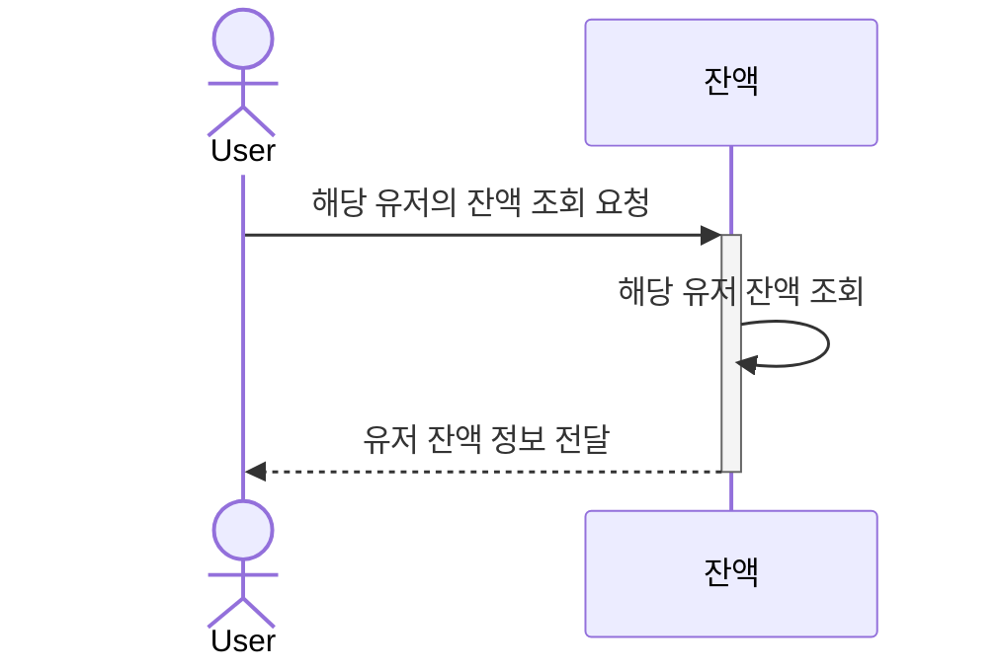
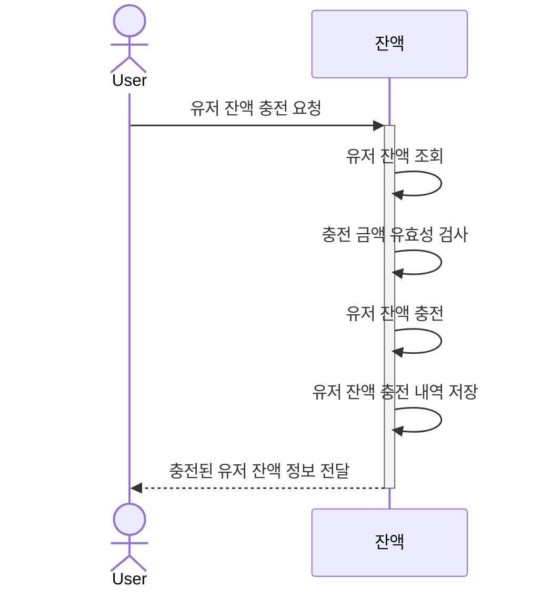
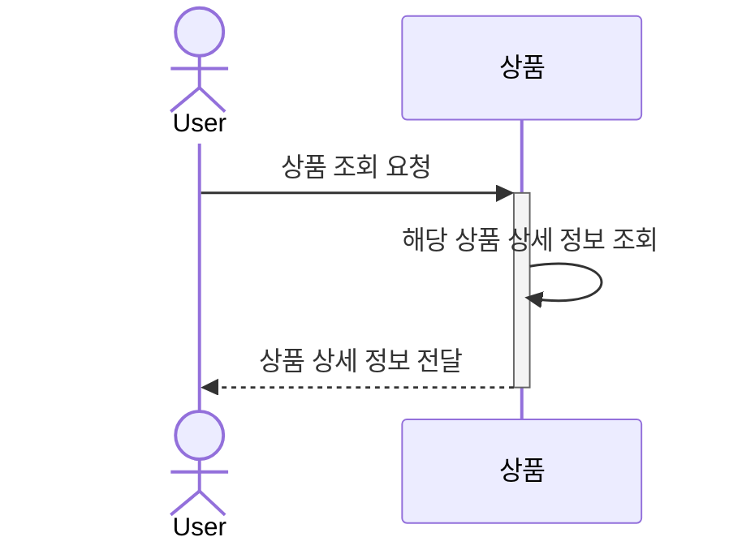
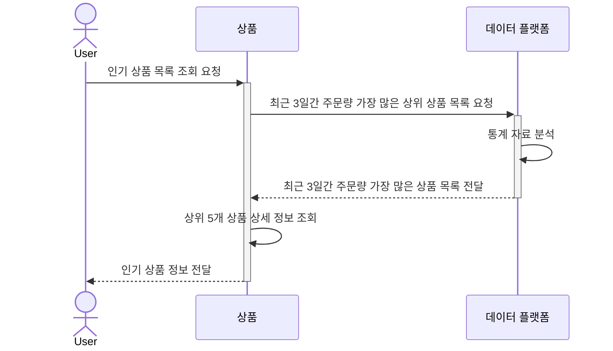
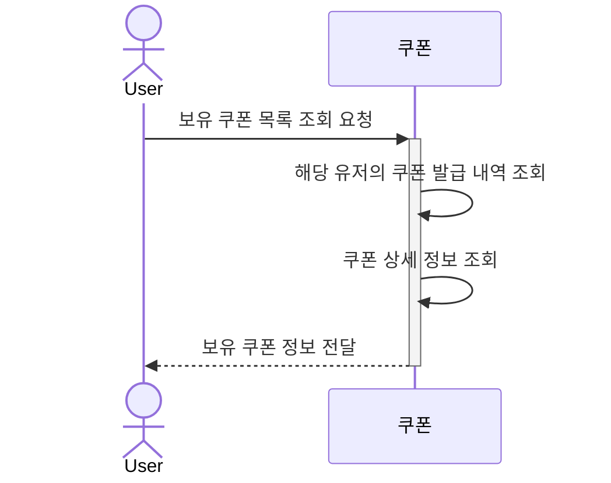
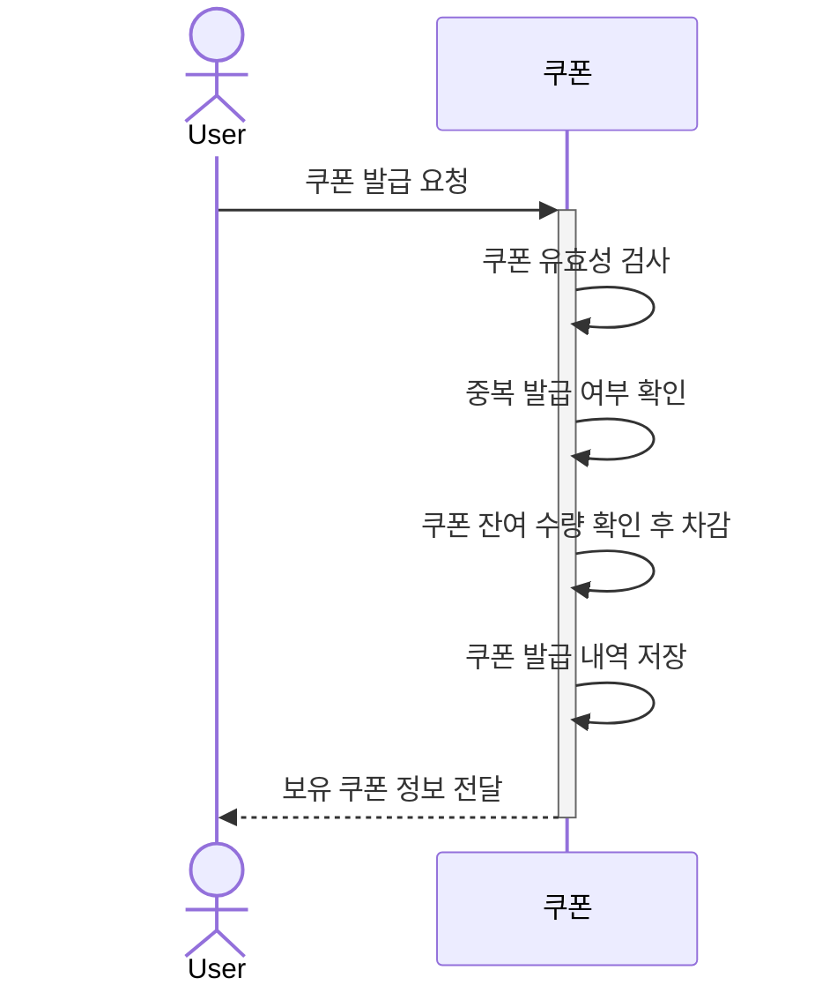
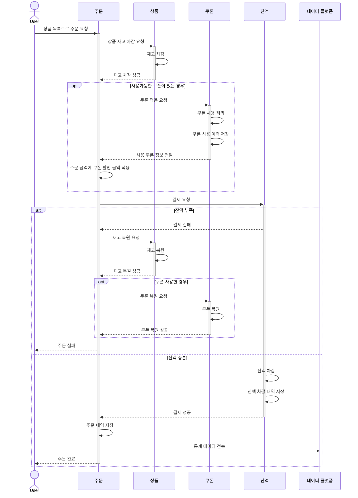
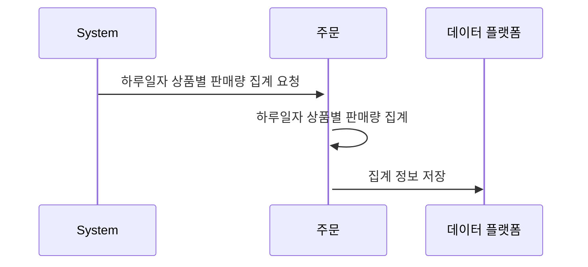

# 시퀀스 다이어그램

## 잔액 조회

```mermaid
sequenceDiagram
    actor User
    participant 잔액
    User->>+잔액: 해당 유저의 잔액 조회 요청
    잔액->>잔액: 해당 유저 잔액 조회
    잔액-->>-User: 유저 잔액 정보 전달
```

## 잔액 충전

```mermaid
sequenceDiagram
    actor User
    participant 잔액
    User->>+잔액: 유저 잔액 충전 요청
    잔액->>잔액: 유저 잔액 조회
    잔액->>잔액: 충전 금액 유효성 검사
    잔액->>잔액: 유저 잔액 충전
    잔액->>잔액: 유저 잔액 충전 내역 저장
    잔액-->>-User: 충전된 유저 잔액 정보 전달
```

## 상품 조회

```mermaid
sequenceDiagram
    actor User
    participant 상품
    User->>+상품: 상품 조회 요청
    상품->>상품: 해당 상품 상세 정보 조회
    상품-->>-User: 상품 상세 정보 전달
```

## 인기 상품 조회

```mermaid
sequenceDiagram
    actor User
    participant 상품
    participant 데이터 플랫폼
    User->>+상품: 인기 상품 목록 조회 요청
    상품->>+데이터 플랫폼: 최근 3일간 주문량 가장 많은 상위 상품 목록 요청
    데이터 플랫폼->>데이터 플랫폼: 통계 자료 분석
    데이터 플랫폼-->>-상품: 최근 3일간 주문량 가장 많은 상품 목록 전달
    상품->>상품: 상위 5개 상품 상세 정보 조회
    상품-->>-User: 인기 상품 정보 전달
```

## 보유 쿠폰 목록 조회

```mermaid
sequenceDiagram
    actor User
    participant 쿠폰
    User->>+쿠폰: 보유 쿠폰 목록 조회 요청
    쿠폰->>쿠폰: 해당 유저의 쿠폰 발급 내역 조회
    쿠폰->>쿠폰: 쿠폰 상세 정보 조회
    쿠폰-->>-User: 보유 쿠폰 정보 전달
```

## 선착순 쿠폰 발급

```mermaid
sequenceDiagram
    actor User
    participant 쿠폰
    User->>+쿠폰: 쿠폰 발급 요청
    쿠폰->>쿠폰: 쿠폰 유효성 검사
    쿠폰->>쿠폰: 중복 발급 여부 확인
    쿠폰->>쿠폰: 쿠폰 잔여 수량 확인 후 차감
    쿠폰->>쿠폰: 쿠폰 발급 내역 저장
    쿠폰-->>-User: 보유 쿠폰 정보 전달
```

## 주문 결제

```mermaid
sequenceDiagram
    actor User
    participant 주문
    participant 상품
    participant 쿠폰
    participant 잔액
    participant 데이터 플랫폼
    User->>+주문: 상품 목록으로 주문 요청
    주문->>+상품: 상품 재고 차감 요청
    상품->>상품: 재고 차감
    상품-->>-주문: 재고 차감 성공
    opt 사용가능한 쿠폰이 있는 경우
        주문->>+쿠폰: 쿠폰 적용 요청
        쿠폰->>쿠폰: 쿠폰 사용 처리
        쿠폰->>쿠폰: 쿠폰 사용 이력 저장
        쿠폰-->>-주문: 사용 쿠폰 정보 전달
        주문->>주문: 주문 금액에 쿠폰 할인 금액 적용
    end
    주문->>+잔액: 결제 요청
    alt 잔액 부족
        잔액-->>주문: 결제 실패
        주문->>+상품: 재고 복원 요청
        상품->>상품: 재고 복원
        상품-->>-주문: 재고 복원 성공
        opt 쿠폰 사용한 경우
            주문->>+쿠폰: 쿠폰 복원 요청
            쿠폰->>쿠폰: 쿠폰 복원
            쿠폰-->>-주문: 쿠폰 복원 성공 
        end
        주문-->>User: 주문 실패 
    else 잔액 충분
        잔액->>잔액: 잔액 차감
        잔액->>잔액: 잔액 차감 내역 저장
        잔액-->>-주문: 결제 성공
        주문->>주문: 주문 내역 저장
        주문->>데이터 플랫폼: 통계 데이터 전송
        주문-->>-User: 주문 완료
    end
```

## 인기 상품 통계 데이터 저장 스케줄러

```mermaid
sequenceDiagram
    participant System
    participant 주문
    participant 데이터 플랫폼
    System->>+주문: 하루일자 상품별 판매량 집계 요청 
    주문->>주문: 하루일자 상품별 판매량 집계
    주문->>데이터 플랫폼: 집계 정보 저장
```